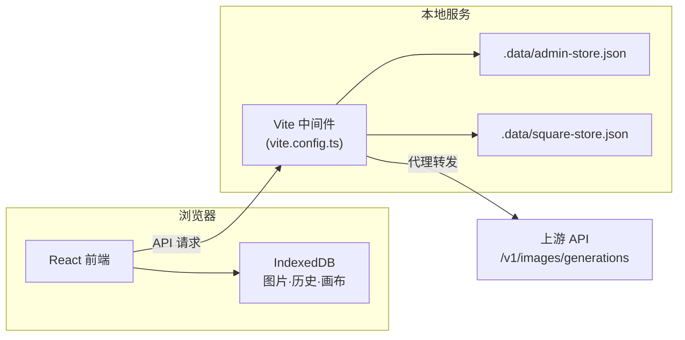

# Image Studio — 本地优先的 AI 生图工作台

> 从一句提示词，到一组可复用的视觉资产。把批量生成、无限画布、智能分析、社区广场和本地图库，放进一个安静、清晰、反应迅速的创作空间。


## 为什么需要 Image Studio

市面上的 AI 生图工具大多是云端 SaaS，生成结果散落在各个平台，本地无法回溯；或者是简单的 API 包装，缺少批量管理、空间化创作和团队协作的能力。

**Image Studio** 以 **local-first** 为底层设计原则——所有图片、提示词、参数和历史记录默认保存在当前浏览器 IndexedDB 中，不经过任何第三方服务器。你拥有自己的数据，不被平台锁定。

## 四大功能模块

### 🎨 工作台（Studio）

全功能批量生图工作站。

- **批量生成**：一次提交 1–20 张图片，1–6 路并发队列，实时显示进度和耗时
- **多模型支持**：`gpt-image-2` / `gpt-image-2-pro` / `gpt-5.4-image-2` 等 image-2 系列模型
- **高分辨率尺寸**：gpt-image-2 / gpt-image-2-pro 支持显式 2K / 4K 尺寸选择，最长边 3840px
- **参考图上传**：最多 6 张参考图，自动压缩到 API 限制，保留原图在本地
- **智能分析**：生成前自动检测提示词风险、参数匹配度和可能的失败原因
- **Agent 模式**：自然语言描述需求，系统自动识别「单图 / 多图批量 / 画册项目」意图并编排生成策略
- **图片预览**：全屏大图预览、参数详情、一键下载、复制提示词、推荐到广场


### 🖼️ 无限画布（Canvas）

空间化迭代式创作工作台——参考 Lovart ChatCanvas 交互范式。

- **无限画布**：DOM + CSS transform 实现的无限二维空间，自由平移缩放
- **图片即节点**：每次生成在画布上创建一个图片节点，自由拖拽排列
- **选中即优化**：选中一张图片，自动作为参考图，补充提示词即可生成优化版本
- **迭代树可视化**：父节点→子节点用 SVG 贝塞尔曲线连接，直观展示创作演化路径
- **独立参数面板**：右侧 360px 可折叠面板，生成模式 / 优化模式自动切换
- **参考图压缩**：优化时自动将选中图片压缩到 1024px WebP 格式作为参考图
- **浮动工具栏**：选中节点后显示「优化 / 下载 / 复制提示词 / 删除」操作栏
- **缩放控制**：底部滑块 + 百分比 + 适应全部 + 小地图
- **持久化**：画布状态和节点图片分别存储在 IndexedDB，关闭浏览器不丢失
- **快捷键**：Space 拖拽、Cmd+/-/0 缩放、E 优化、M 小地图、Delete 删除

### 🏛️ 广场（Square）

创作者作品展示与发现社区。

- **推荐到广场**：成功生成的图片一键推荐，服务端保存 1K 压缩缩略图
- **多维度浏览**：最新 / 热门 / 精选 / 本周 / 本月，触底无限懒加载
- **点赞互动**：每日 10 次推荐配额、10 次点赞配额，按 API Key 哈希识别身份
- **展示位管理**：单 Key 最多 4 张展示位，超出自动替换最早作品
- **原图保护**：广场只存储压缩缩略图，原图始终保留在创作者本地

### 🛡️ 管理后台（Admin）

运维与治理仪表盘。

- **请求统计**：总请求数、成功率、平均耗时、模型使用分布、失败原因 Top
- **日志查询**：按状态和关键词筛选请求日志，requestId 可与客户端对齐排查
- **广场治理**：展示数、推荐尝试、替换率、点赞数、拒绝原因和风控事件
- **数据导出**：按天导出广场明细，支持 JSON 和 CSV 格式


## 快速开始

### 环境要求

- Node.js >= 18
- 支持 `image-2` 系列模型的 API Key

### 安装与启动

```bash
git clone https://github.com/d100000/ImageHub.git
cd ImageHub
npm install
npm run dev
```

打开浏览器访问 http://localhost:8877

### 生产构建

```bash
npm run build     # TypeScript 检查 + Vite 构建
npm run preview   # 预览生产包
```

### 管理员配置

默认管理员账号 `admin` / `admin123456`，首次登录强制重置密码。

```bash
# 自定义初始管理员
ADMIN_USERNAME=admin ADMIN_INITIAL_PASSWORD=your-password npm run dev
```

管理后台地址：http://localhost:8877/#admin

## 使用流程

### 标准模式

1. 进入工作台，选择 API URL，填写 API Key（自动验证并读取模型列表）
2. 选择模型、设置宽高比 / 分辨率 / 质量 / 张数 / 并发
3. 输入提示词，可上传参考图
4. 点击生成 → 实时进度 → 预览 / 下载 / 推荐到广场

### Agent 模式

1. 开启 Agent 模式 → 输入自然语言需求
2. 系统流式分析意图：单图自动执行，多图/画册展示任务拆解
3. 确认后统一提交，结果进入画廊

### 画布模式

1. 进入画布页面，在右侧面板输入提示词
2. 点击「生成到画布」→ 图片节点出现在画布上
3. 选中图片 → 点击「优化」→ 补充提示词 → 基于参考图生成新版本
4. 反复迭代，构建视觉创作演化树

## 系统架构



**关键设计决策：**

- **全栈单文件**：前端 `src/App.tsx`（~11000 行），后端 `vite.config.ts`（~4200 行），样式 `src/styles.css`（~7900 行）
- **无外部依赖**：画布用原生 DOM + CSS transform，不引入 react-flow / fabric.js
- **无路由库**：URL hash (`#studio` / `#canvas` / `#square` / `#admin`) + `activePage` 状态切换
- **无状态管理库**：纯 `useState` + `useRef`，生成队列用 ref 避免渲染抖动
- **IndexedDB v3**：三个 store — `history`（生成记录）、`canvas-state`（画布状态）、`canvas-images`（画布图片）

## 数据与隐私策略

Image Studio 采用 **local-first** 设计，隐私保护是产品底线：

| 数据类型 | 存储位置 | 说明 |
|---------|---------|------|
| 生成图片 Blob | 浏览器 IndexedDB | 不上传服务端 |
| 画布节点图片 | 浏览器 IndexedDB | 不上传服务端 |
| 提示词·参数·历史 | 浏览器 IndexedDB | 本地回溯 |
| API Key | 浏览器 Storage | 服务端仅记录长度和 4 字符前缀 |
| 广场缩略图 | 服务端 JSON | 用户主动推荐才上传，最长边 1024px |
| 请求元数据 | 服务端 JSON | 仅记录 model / status / duration / error 类型 |

**绝不记录：** API Key 原文、图片 URL、图片 base64、参考图内容。

## API 端点

<details>
<summary>生成与模型</summary>

```
POST /api/models              # 读取可用模型列表
POST /api/images/generate     # 生成图片（代理转发）
GET  /api/temp-reference/:id  # 临时参考图 URL（内存 10min TTL）
POST /api/agent/analyze       # Agent 意图分析
```

</details>

<details>
<summary>广场</summary>

```
GET  /api/square/feed?tab=latest&cursor=&limit=20  # 浏览 feed
GET  /api/square/quota                              # 查询配额
POST /api/square/recommend                          # 推荐图片
POST /api/square/like                               # 点赞/取消
GET  /api/square/image/:id                          # 缩略图二进制
GET  /api/square/admin/overview                     # 广场概览
GET  /api/square/admin/export?format=json&dateKey=  # 数据导出
```

</details>

<details>
<summary>管理员</summary>

```
POST /api/admin/login            # 登录
POST /api/admin/logout           # 登出
POST /api/admin/change-password  # 修改密码
GET  /api/admin/me               # 当前会话
GET  /api/admin/stats            # 统计数据
GET  /api/admin/requests         # 请求日志
```

</details>

## 业务规则

| 规则 | 默认值 |
|------|--------|
| 单 Key 广场展示位 | 4 张 |
| 每日推荐配额 | 10 次 |
| 每日点赞配额 | 10 次 |
| 广场分页大小 | 20 条 |
| 缩略图尺寸 | 最长边 1024px |
| API URL 白名单 | `taijiai.online` / `bobdong.cn` |
| 模型白名单 | 名称含 `image-2` |
| 管理员密码 | scrypt 哈希，首次登录强制重置 |

## 技术栈

| 技术 | 用途 |
|------|------|
| React 19 | UI 框架 |
| TypeScript 5.7 | 类型安全 |
| Vite 6 | 构建工具 + 后端中间件 |
| lucide-react | 图标库 |
| IndexedDB | 本地数据持久化 |
| CSS Custom Properties | 主题系统 |
| scrypt | 管理员密码哈希 |

## 项目结构

```
├── src/
│   ├── App.tsx          # 全部前端逻辑（~11000 行）
│   ├── main.tsx         # React 挂载入口
│   ├── styles.css       # 全局样式（~7900 行）
│   └── assets/          # Logo、首页截图
├── vite.config.ts       # Vite 配置 + 全部后端中间件（~4200 行）
├── docs/
│   ├── agent-mode-brochure-prd.md   # Agent 模式产品规格
│   ├── canvas-mode-prd.md           # 画布模式产品规格
│   └── screenshots/                 # README 截图
├── .data/               # 运行时数据（gitignored）
│   ├── admin-store.json # 管理员 + 请求日志
│   └── square-store.json# 广场数据
└── package.json
```

## 适用场景

- 📦 电商商品图批量探索与 A/B 测试
- 📱 社媒封面、短视频封面批量生成
- 🎨 海报、场景图、人物图方向迭代
- 📐 官网头图、活动视觉、销售物料生成
- 📖 宣传画册 / 彩页初稿探索（Agent 模式）
- 🖼️ 创意迭代与视觉演化探索（画布模式）
- 👥 团队内部作品展示与提示词复用（广场）
- 🔍 多模型生图接口验证与性能对比
- 📊 生成历史回溯与失败原因排查

## 开发说明

以下目录不会提交到仓库：

```
dist/                  # 构建产物
node_modules/          # 依赖
.data/                 # 运行时数据
generated_images/      # 临时生成图
screenshot-*.png       # 截图文件
```

## 许可证

本项目仅供学习和内部使用。
